# Ninja — Slay the Spire 2 custom character mod

`NinjaMod` adds a selectable **Ninja (忍者)** character to Slay the Spire 2. The character is
built around **Bleed**, delayed **fire ninjutsu** damage, **stealth/clone** tempo and defensive
**ninjutsu**. This is a robust, minimal, playable v0.1.

- Internal mod id: `NinjaMod` (BaseLib applies this as the stable id namespace/prefix for all content)
- Project / output name: `NinjaMod`
- Character: **Ninja / 忍者** — 72 max HP, 3 energy/turn, default starting gold
- Starting relic: **Hidden Blade / 藏刃**
- Starting deck: 4× Ninja Strike, 4× Ninja Defend, 1× Shuriken, 1× Assassination

> All game-specific absolute paths live in `local.props` (gitignored). No proprietary game DLLs
> or assets are committed to this repo — the project references the game DLL by local path only.

---

## Template & dependencies

- **Template:** `Alchyr.Sts2.Templates` → *Slay the Spire 2 Character* (`alchyrsts2charmod`, v2.5.0),
  generated with `--PublicizeSts true`.
- **Content dependency:** `Alchyr.Sts2.BaseLib` (3.3.2) — the standard StS2 content library.
- **Build-time packages:** `Krafs.Publicizer`, `Alchyr.Sts2.ModAnalyzers`, `BSchneppe.StS2.PckPacker`
  (generates the mod `.pck` from simple PNG/JSON assets without needing a full Godot/MegaDot export).
- **Engine:** Godot.NET.Sdk 4.5.1, targeting `net9.0`.

## Prerequisites

- Windows + Steam install of Slay the Spire 2.
- **.NET 9 SDK** (`dotnet --list-sdks` should list a `9.x` SDK).
- The game at the path configured in `local.props`.

## Local configuration (`local.props`, gitignored)

```xml
<Project>
  <PropertyGroup>
    <GameDir>D:\SteamLibrary\steamapps\common\Slay the Spire 2</GameDir>
    <ModsDir>D:\SteamLibrary\steamapps\common\Slay the Spire 2\mods</ModsDir>
    <Sts2Path>$(GameDir)</Sts2Path>
  </PropertyGroup>
</Project>
```

`Directory.Build.props` (also gitignored) imports `local.props`. If `local.props` is missing, the
template's `Sts2PathDiscovery.props` tries to auto-detect Steam.

---

## Build / install / play

All commands are Windows PowerShell, run from the repo root.

### 1. One-time setup (validates env, installs BaseLib)

```powershell
powershell -ExecutionPolicy Bypass -File scripts\setup.ps1
```

This validates the game path, the mods folder and the .NET SDK, and installs **BaseLib** into
`<ModsDir>\BaseLib` from the **official** `Alchyr.Sts2.BaseLib` NuGet package (no unofficial
downloads). If you already manage BaseLib via the official Steam Workshop release, that is used
instead.

### 2. Build

```powershell
powershell -ExecutionPolicy Bypass -File scripts\build.ps1            # Debug (default)
powershell -ExecutionPolicy Bypass -File scripts\build.ps1 -Configuration Release
```

### 3. Install into the game

```powershell
powershell -ExecutionPolicy Bypass -File scripts\install.ps1
```

Copies `NinjaMod.dll`, `NinjaMod.json`, `NinjaMod.pck` and `NinjaMod.pdb` into
`<ModsDir>\NinjaMod`. It never deletes other mods.

### 4. Build + install in one step

```powershell
powershell -ExecutionPolicy Bypass -File scripts\build-and-install.ps1
```

> The build also auto-copies outputs to the mods folder via an MSBuild post-build target, so a
> plain `dotnet build NinjaMod.csproj` installs the DLL/JSON/PCK too.

### 5. Publish to Steam Workshop

```powershell
powershell -ExecutionPolicy Bypass -File workshop\upload.ps1
```

Requires: Steam account owning Slay the Spire 2 + Steam Guard app on phone.
Enter credentials + Guard code when prompted. First upload creates a new workshop item;
update `workshop\upload.vdf` → `publishedfileid` for subsequent updates.

### Installed layout

```
<ModsDir>\BaseLib\   BaseLib.dll, BaseLib.json, BaseLib.pck
<ModsDir>\NinjaMod\  NinjaMod.dll, NinjaMod.json, NinjaMod.pck, NinjaMod.pdb
```

---

## Manual in-game test checklist

1. Launch Slay the Spire 2 from Steam.
2. Enable mods if the game asks; ensure **BaseLib** is enabled (and loads before NinjaMod).
3. Start a new run.
4. Select **Ninja**.
5. Confirm HP is **72**.
6. Confirm energy is **3**.
7. Confirm the starting deck has 4 Ninja Strike, 4 Ninja Defend, 1 Shuriken, 1 Assassination.
8. Confirm the starting relic **Hidden Blade** is present.
9. Start combat and confirm a **Kunai** is added to your hand at the start of each of your turns.
10. Confirm Kunai/Shuriken apply **Bleed** only when their damage actually reaches HP (not when fully blocked).
11. Confirm **Assassination** ignores Block and still triggers existing Bleed.
12. Confirm **Burning** triggers at the enemy's next turn start, and that **Demon Flame Burst** ignites it.
13. Confirm **Resist** (from Earth Escape) reduces each incoming attack hit before Block.
14. Confirm **Shadow Clone** makes your other cards resolve twice and does not recurse on itself.

---

## Card Gallery / 卡牌图鉴

> 卡牌描述与代码中的原文一致。点击图片查看大图（`images/card_portraits/`，250×350 px）。

### Basic（基础牌）

<table>
<tr align="center">
<td width="25%">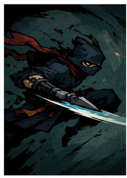<br><b>忍者打击</b><br>1⚡ 攻击<br><small>造成 6(9) 点伤害。</small></td>
<td width="25%">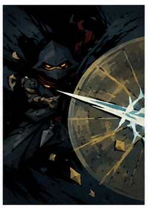<br><b>忍者防御</b><br>1⚡ 技能<br><small>获得 5(8) 点格挡。</small></td>
<td width="25%">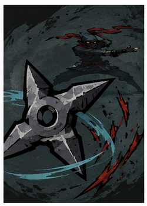<br><b>手里剑</b><br>1⚡ 攻击<br><small>造成 10(13) 点伤害。如果未被完全格挡，施加 2(3) 层流血。</small></td>
<td width="25%">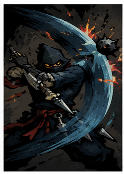<br><b>暗杀</b><br>1⚡ 攻击<br><small>无视格挡，造成 7(10) 点伤害。静默。</small></td>
</tr>
</table>

### Token（衍生牌，不出现在奖励池）

<table>
<tr align="center">
<td width="25%">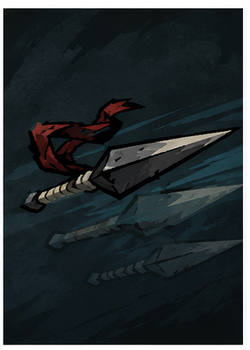<br><b>飞刀</b><br>1⚡ 攻击 · 保留 · 消耗<br><small>造成 5(7) 点伤害。如果未被完全格挡，施加 1 层流血。</small></td>
<td width="25%"><br><b>注入手里剑</b><br>1⚡ 攻击 · 保留 · 消耗<br><small>造成 10 点伤害。未被完全格挡施加 2 层流血。燃烧追加 6。</small></td>
<td width="25%">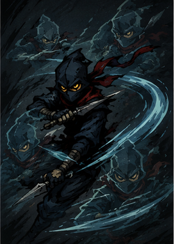<br><b>残影</b><br>0⚡ 攻击 · 消耗<br><small>造成动态伤害（复制源攻击牌伤害减半）。</small></td>
</tr>
</table>

### Common（普通）

<table>
<tr align="center">
<td width="25%">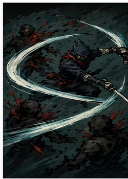<br><b>武士刀法</b><br>1⚡ 攻击<br><small>对所有敌人造成 5 点伤害，共 2(3) 次。</small></td>
<td width="25%">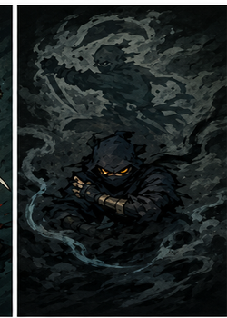<br><b>潜行</b><br>0⚡ 技能<br><small>获得 4 点格挡。下个回合开始时，获得一张暗杀。</small></td>
<td width="25%">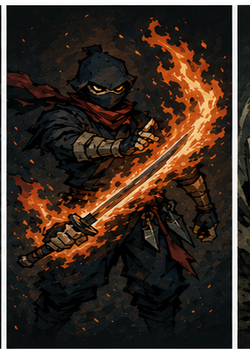<br><b>火忍：淬火术</b><br>1⚡ 技能<br><small>获得 3(4) 层淬火。本回合，攻击牌每次造成伤害额外附加等同于淬火层数的燃烧。</small></td>
<td width="25%">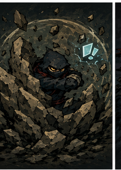<br><b>土忍：碎石</b><br>1⚡ 技能 · 消耗<br><small>获得 8(13) 点格挡。自动免费打出手牌中所有忍者防御，随后移除 1 层抵挡。</small></td>
</tr>
<tr align="center">
<td width="25%">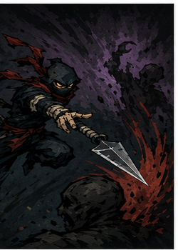<br><b>苦无</b><br>1⚡ 攻击<br><small>造成 6(9) 点伤害。如果目标有流血，恢复 1 点能量。</small></td>
<td width="25%">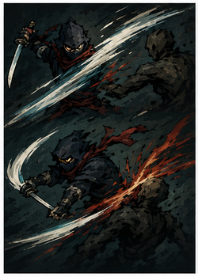<br><b>居合</b><br>2⚡ 攻击<br><small>造成 10(15) 点伤害。若打出后仍有能量，额外造成 5(8) 点伤害并附加 3 层流血。</small></td>
<td width="25%">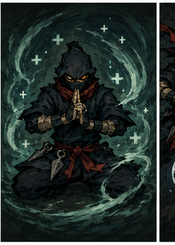<br><b>气合</b><br>1⚡ 技能<br><small>回复 4(6) 点生命。</small></td>
<td width="25%">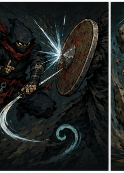<br><b>燕返</b><br>1⚡ 攻击<br><small>造成 4(7) 点伤害。如果伤害被完全格挡，获得 1 点能量。</small></td>
</tr>
<tr align="center">
<td width="25%">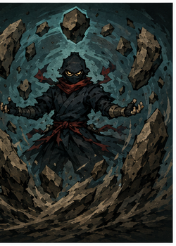<br><b>土忍：唤石</b><br>1⚡ 技能<br><small>获得动态格挡（随当前抵挡层数提升）。</small></td>
<td width="25%">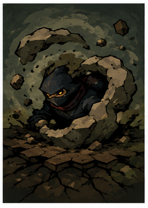<br><b>土忍：土遁</b><br>0⚡ 能力<br><small>获得 1(2) 层抵挡。</small></td>
<td width="25%">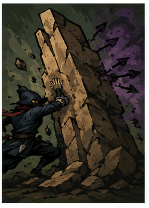<br><b>土忍：土墙</b><br>1⚡ 技能<br><small>获得 7(10) 点格挡，并获得免疫负面效果 2 个回合。</small></td>
<td width="25%">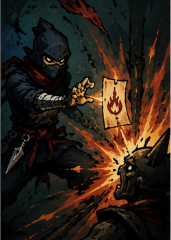<br><b>火忍：起爆符</b><br>0⚡ 技能<br><small>点燃目标的燃烧（造成燃烧 2 倍的无法格挡伤害并移除）。</small></td>
</tr>
<tr align="center">
<td width="25%">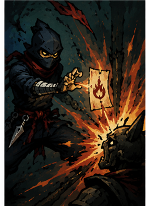<br><b>火忍：锻火刺</b><br>1⚡ 攻击<br><small>造成 6(9) 点伤害，附加 4(5) 层燃烧。</small></td>
<td width="25%">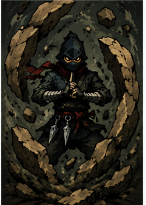<br><b>土忍：聚石刺</b><br>1⚡ 攻击<br><small>造成 6(9) 点伤害，获得 6(9) 点格挡。</small></td>
<td width="25%">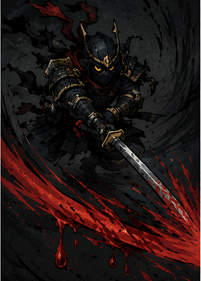<br><b>武藏：刺</b><br>0⚡ 攻击 · 消耗<br><small>造成 9 点伤害，附加 2 层流血。</small></td>
</tr>
</table>

### Uncommon（罕见）

<table>
<tr align="center">
<td width="25%">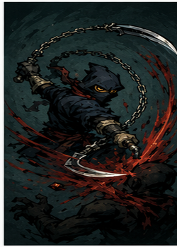<br><b>锁镰</b><br>1⚡ 攻击<br><small>造成 9(12) 点伤害。如果目标有流血，额外造成 4(6) 点伤害。</small></td>
<td width="25%">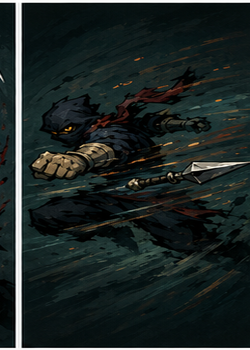<br><b>起承拳</b><br>1⚡ 攻击<br><small>造成 6(9) 点伤害。如果手牌中有飞刀，自动免费打出一张飞刀。</small></td>
<td width="25%">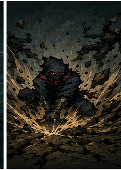<br><b>土忍：裂地</b><br>1⚡ 技能<br><small>获得动态格挡（所有敌人负面效果层数之和）。</small></td>
<td width="25%">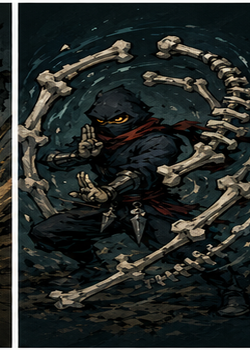<br><b>骨法</b><br>1⚡ 技能<br><small>获得 11 点格挡，并获得 2 点活力。</small></td>
</tr>
<tr align="center">
<td width="25%">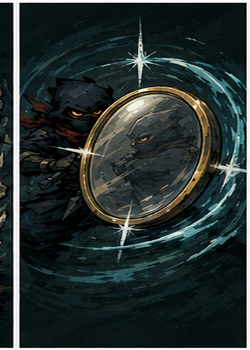<br><b>八咫镜</b><br>1⚡ 能力<br><small>每回合开始时，获得 2(3) 点格挡。</small></td>
<td width="25%">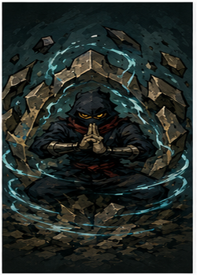<br><b>九字护身法</b><br>2(1)⚡ 能力 · 消耗<br><small>获得 3 点抵挡。每回合开始时，额外获得当前抵挡层数 2 倍的格挡。</small></td>
<td width="25%">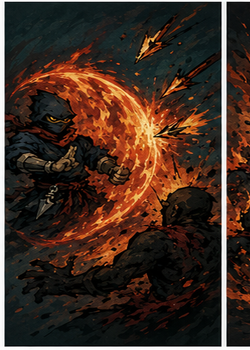<br><b>火忍：火盾</b><br>1(0)⚡ 能力<br><small>获得 1 层火盾：每当你受到攻击时，对攻击者施加等同于火盾层数的燃烧。</small></td>
<td width="25%">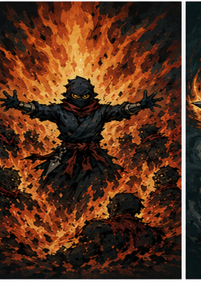<br><b>火忍：豪炎</b><br>0⚡ 技能<br><small>对所有敌人施加 7(9) 层燃烧。</small></td>
</tr>
<tr align="center">
<td width="25%">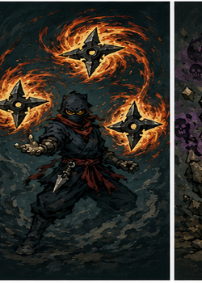<br><b>火忍：凤仙花爪红</b><br>1⚡ 技能 · 消耗<br><small>在手牌中生成 2 张带燃烧追加的手里剑（保留、消耗）。</small></td>
<td width="25%">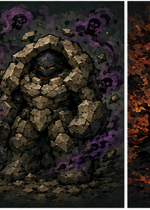<br><b>土忍：石化术</b><br>2(1)⚡ 技能<br><small>获得 13 点格挡，并清除自身所有负面效果。</small></td>
<td width="25%">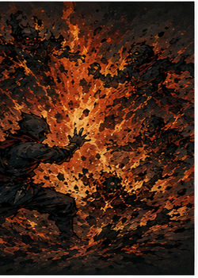<br><b>火忍：灰烬</b><br>1(0)⚡ 技能<br><small>点燃所有敌人身上的燃烧（造成燃烧 2 倍的无法格挡伤害并移除）。如果成功点燃，抽 1 张牌。</small></td>
<td width="25%">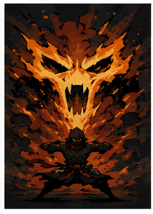<br><b>火忍：火魔爆</b><br>2⚡ 技能<br><small>造成 12(16) 点伤害，然后引爆目标身上的所有燃烧（造成燃烧层数 2 倍的无法格挡伤害并移除）。</small></td>
</tr>
<tr align="center">
<td width="25%">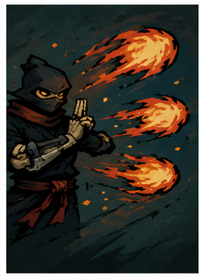<br><b>火忍：火焰弹幕</b><br>1⚡ 技能<br><small>造成 3 次 2(3) 点伤害，然后施加 3(4) 层燃烧。</small></td>
<td width="25%">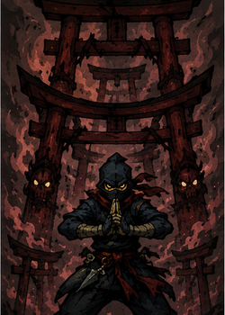<br><b>多重罗生门</b><br>2⚡ 技能<br><small>抽 3(4) 张牌。抽到的牌中每有一张攻击牌，获得 9 点格挡。</small></td>
<td width="25%">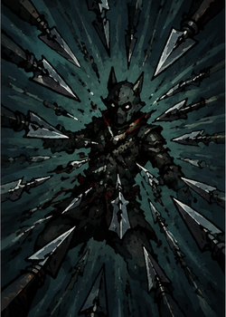<br><b>追魂</b><br>3⚡ 技能 · 消耗<br><small>对目标打出消耗牌堆中的所有飞刀（每张造成其伤害）。若成功击杀，抽 2(3) 张牌。</small></td>
<td width="25%">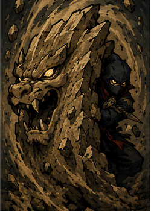<br><b>守鹤之盾</b><br>2(1)⚡ 技能 · 消耗<br><small>获得动态格挡（等同于当前已损失的生命值）。</small></td>
</tr>
<tr align="center">
<td width="25%">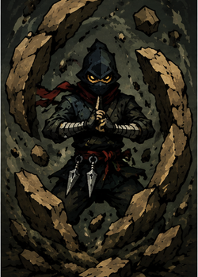<br><b>土忍：土护符</b><br>1(0)⚡ 技能 · 消耗<br><small>获得动态格挡（等同于当前消耗牌堆中的牌数）。</small></td>
<td width="25%">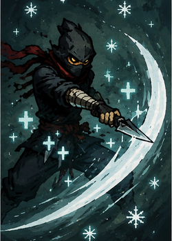<br><b>细雪</b><br>1⚡ 攻击<br><small>造成 1 点伤害，共 4 段，回复 2(3) 点生命。</small></td>
<td width="25%">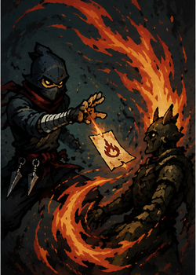<br><b>火忍：离火符</b><br>0⚡ 技能<br><small>给予目标 5(8) 层燃烧。</small></td>
<td width="25%">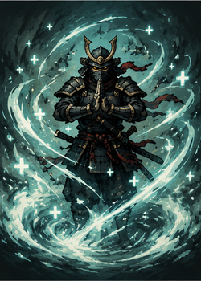<br><b>武藏：前进喷泉</b><br>1⚡ 技能 · 消耗<br><small>回复 4 点生命，下个回合额外获得 1(2) 点能量。</small></td>
</tr>
<tr align="center">
<td width="25%">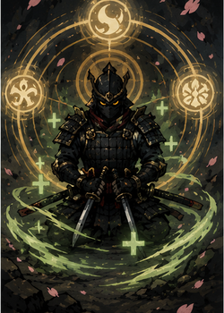<br><b>武藏：圆明流</b><br>1(0)⚡ 能力<br><small>获得 1 层圆明：每当你打出一张"武藏"牌，回复等同于圆明层数的生命。</small></td>
<td width="25%">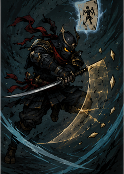<br><b>武藏：神速</b><br>0⚡ 技能 · 消耗<br><small>造成 3(5) 点伤害，获得 8(11) 点格挡，并抽 1 张牌。</small></td>
<td width="25%">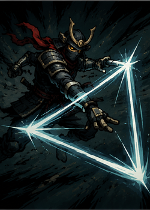<br><b>武藏：迅光三角剑</b><br>1⚡ 技能<br><small>造成 11(15) 点伤害，获得 3(4) 点敏捷。</small></td>
<td width="25%">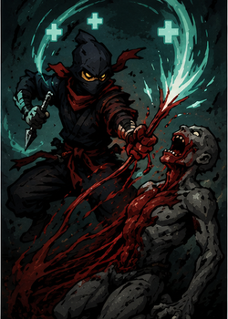<br><b>索命</b><br>2⚡ 技能<br><small>移除目标身上最多 8(12) 层流血，回复等同于移除层数的生命。若移除后目标没有流血，抽 1 张牌并回复 1 点能量。</small></td>
</tr>
</table>

### Rare（稀有）

<table>
<tr align="center">
<td width="25%">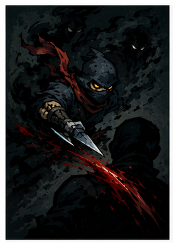<br><b>影心刺</b><br>0⚡ 攻击<br><small>造成 9(14) 点伤害，附加 5(6) 层流血。静默。</small></td>
<td width="25%">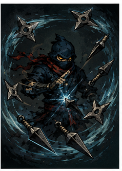<br><b>锄刃</b><br>2(1)⚡ 能力 · 消耗<br><small>本场战斗中，所有牌堆中以及后续生成的手里剑、飞刀与火焰手里剑的能量消耗降低 1。</small></td>
<td width="25%">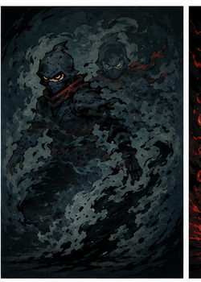<br><b>隐身法</b><br>2(1)⚡ 能力<br><small>获得 1 点活力，并获得 3 层隐身（敌人无法攻击你；每回合失去 1 层，攻击后立即结束）。</small></td>
<td width="25%">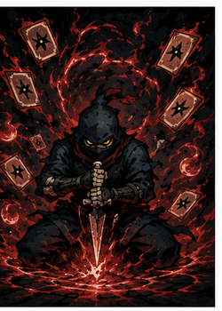<br><b>切腹</b><br>X⚡ 技能<br><small>失去 2X 点生命，获得 X 点能量、抽 X 张牌、获得 X 点力量。</small></td>
</tr>
<tr align="center">
<td width="25%">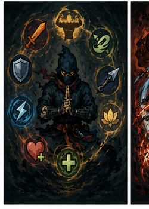<br><b>忍者八法</b><br>1⚡ 技能<br><small>获得 1 点力量、1 点抵挡、1 点活力、1 点能量、1 点格挡、1 张飞刀、1 点最大生命，并回复 1 点生命。</small></td>
<td width="25%"><br><b>须佐能乎</b><br>3⚡ 攻击<br><small>造成 7(9) 点伤害，共 6 段，每段追加 1 层流血。</small></td>
<td width="25%"><br><b>回天：绝对防御</b><br>2⚡ 技能<br><small>获得 20(30) 点格挡，回复 4(6) 点生命。</small></td>
<td width="25%"><br><b>影分身</b><br>3(2)⚡ 技能<br><small>本回合及下回合：①每张非影分身卡额外结算一次；②受到的攻击伤害减少 40%；③若你有荆棘，克隆体对攻击者造成等量反击。</small></td>
</tr>
<tr align="center">
<td width="25%"><br><b>火忍：燃心</b><br>X⚡ 技能<br><small>进入抽牌堆，消耗最多 X 张牌（K 张），给予所有敌人 K × 3 层燃烧。</small></td>
<td width="25%"><br><b>残影术</b><br>2(1)⚡ 能力<br><small>获得 1 层残影。</small></td>
<td width="25%"><br><b>武藏：承袭</b><br>3(2)⚡ 技能 · 消耗<br><small>将各一张【神速】【空明斩】【刺】加入手牌。下回合开始获得 3 点能量。</small></td>
<td width="25%"><br><b>武藏：七星光芒斩</b><br>2⚡ 技能<br><small>造成 7 点伤害，共 7 段。升级后，追加第 8 段斩杀伤害：目标每损失 5 点生命，造成 1 点伤害。</small></td>
</tr>
<tr align="center">
<td width="25%"><br><b>武藏：二天一流</b><br>3(2)⚡ 技能<br><small>造成 16 点伤害，共 2 段。若目标同时拥有流血与燃烧，则使其眩晕。</small></td>
<td width="25%"><br><b>武藏：空明斩</b><br>0⚡ 攻击 · 消耗<br><small>造成 15(21) 点伤害，获得 1(2) 点抵挡。</small></td>
</tr>
</table>

> **贴图命名规则**：`images/card_portraits/<snake_case>.png` + `big/<snake_case>.png`。注入手里剑复用 `shuriken.png`。

---

## 自定义机制速查

| 关键词 | 类型 | 说明 |
|---|---|---|
| 流血 (Bleed) | Debuff | 受未被格挡的攻击伤害时，额外失去等量生命 |
| 燃烧 (Burning) | Debuff | 下回合开始时受到等量无法格挡伤害后移除；可引爆（×2） |
| 抵挡 (Resist) | Buff | 每次受攻击伤害前减免等量数值（格挡计算之前） |
| 静默 (Silence) | 卡牌属性 | 打出后不破除隐身（黄字显示，可悬停查看） |
| 隐身 (Stealth) | Buff | 敌人无法攻击你；攻击后失去（静默牌除外）；每回合-1 |
| 燃烧追加 (Burning Infusion) | 卡牌属性 | 攻击命中后额外施加对应层数燃烧 |
| 淬火 (Quenching) | Buff | 本回合攻击命中时附加等量燃烧；回合结束移除 |
| 火盾 (Flame Shield) | Buff | 受击时对攻击者施加等量燃烧 |
| 影分身 (Shadow Clone) | Buff | 非影分身卡×2结算 + 受击-40% + 荆棘反击 |
| 圆明 (Enmei) | Buff | 打出武藏牌时回复等量生命（可叠加） |
| 残影 (Afterimage) | Buff | 打出攻击牌→生成N张0费半伤复制到弃牌堆 |
| 免疫负面 (Debuff Immunity) | Buff | 免疫Debuff，持续回合递减 |

---

## How the custom mechanics are implemented (verified against the installed BaseLib/game API)

- **Bleed** uses the `AfterDamageReceived` hook and `DamageResult.UnblockedDamage` to detect HP
  loss. It only triggers on **move (attack)** damage. The bonus is dealt as
  `Unblockable | Unpowered` (not a move), so it **cannot trigger itself** (no recursion). A boolean
  guard is also present as a safety net.
- **Burning** uses `AfterSideTurnStart` (like Poison) to deal `Unblockable | Unpowered` damage at the
  affected enemy's next turn start, then removes itself. *Ignite* deals `Burning × 2` and removes it.
- **Resist** uses `ModifyDamageAdditive` (the same pre-block hook Strength uses) to reduce each
  incoming attack hit before Block. It does not reduce unblockable HP loss.
- **Debuff Immunity** uses `TryModifyPowerAmountReceived` (like Artifact) to cancel debuffs on the
  owner, ticking down at end of turn until end of next turn.
- **Shadow Clone** uses `ModifyCardPlayCount` (like Duplication) to resolve each non-Shadow-Clone
  card an extra time while active; the play-count hook is queried once per play, so copies cannot
  recurse.
- The **Ninja passive** (add a Kunai each turn) lives on the **Hidden Blade** relic, because relics
  are reliably part of the combat hook loop.

---

## Architecture notes

- **Localization** is in-code (BaseLib-recommended), language-aware (zh/eng).
- **Custom powers**: 15 total — `BleedPower`, `BurningPower`, `ResistPower`, `StealthPower`, `ShadowClonePower`, `DebuffImmunityPower`, `FlameShieldPower`, `QuenchingPower`, `YataMirrorPower`, `KujiProtectionPower`, `ProwlPower`, `AfterimagePower`, `EnmeiPower`, `BladeEdgePower`.
- **`HasSilence`** (静默) is a virtual bool on `NinjaModCard` — cards with this attribute do not break Stealth when played. Override as `=> IsUpgraded` for upgrade-granted silence. Hover tip auto-generated.
- **X-cost cards**: `HasEnergyCostX => true` with base cost 0. Use `ResolveEnergyXValue()` in `OnPlay`.

## 贴图命名

`images/card_portraits/<snake_case>.png` + `big/<snake_case>.png`。如 `KatanaArt` → `katana_art.png`。注入手里剑复用 `shuriken.png`。类名→蛇形规则由 `StringExtensions.cs` 处理。

---

## Repository notes

- `local.props` / `Directory.Build.props` are gitignored (machine-specific paths).
- `bin/`, `obj/`, `.godot/`, `*.pck`, `*.pdb`, logs, temp/ are gitignored EXCEPT `dist/NinjaMod/` (committed as release payload).
- `dist/NinjaMod/` contains the latest DLL+JSON+PCK for friend install: copy this folder into `<game>\mods\`.
- No copyrighted game assets or DLLs committed.

