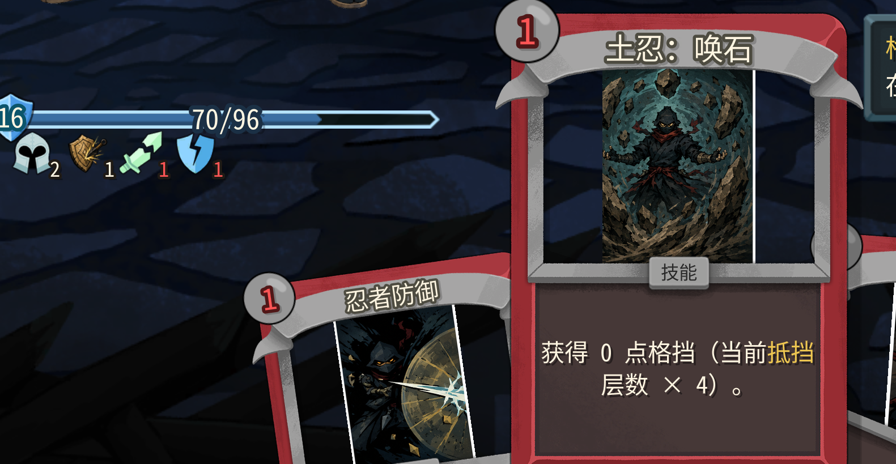
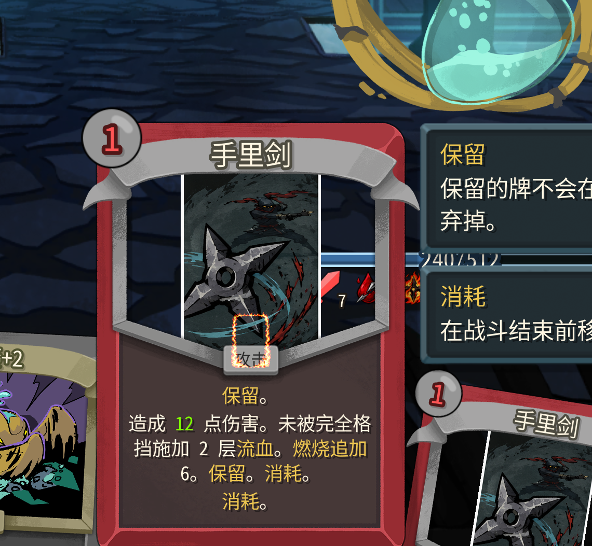

重大修复需求：目前pck什么的没有打包到github云端，我的朋友下载我的mod之后他是无法看到任何贴图的。

upd:
1. 锋刃需要调整一下，额外把苦无这张牌的耗能也减少一点。

2. 
土忍：唤石这张牌并没有根据抵挡层数来显示实际上的格挡数值。需要调整。

3. 须佐能乎：这张牌需要调整的是他多段之间的攻击间隔，我希望攻击的快一些。（牌面和数值不需要优化）。

fix: 

这个不对的，边框应该是刚好包围好这张卡牌的。

通关第三层之后到建筑师这里，没有触发剧情。请仔细参考杀戮尖塔2 的设计这里要么直接跳过要么用一个代替的剧情也许可以

调整卡牌：
暗杀：新增效果，不会破除隐身。（比如说如果当前在隐身状态下打出这张攻击牌不会破隐）
影心刺：新增效果，打出这张牌不会破除隐身。

新增卡牌：
武藏：神速：0费，技能，造成4(7)点伤害，获得4（6）点格挡，并抽1张牌。
武藏：空明斩：1费，攻击，造成15(21)点伤害，获得1点抵挡。
武藏：二天一流：3(2)费，技能，造成22点伤害，如果目标身上同时有流血和燃烧，则眩晕1回合。

七星忍：迅光三角剑：1费，技能，造成11(15)点伤害，下个回合获得3(4)点敏捷。
七星忍：前进喷泉：1费，技能，恢复7点生命，下个回合额外获得1(2)点能量。消耗
七星忍：七星光芒斩：2费，技能，造成7 x 7点伤害。（升级后：追加一段斩杀伤害：敌人每损失5点生命，额外造成1点伤害）

细雪：攻击，0费，造成6 * 1点伤害，恢复3点(6)生命。
追魂：技能，3(2)费，对目标打出消耗牌堆中的所有飞刀。消耗。
索命：技能，2（1）费，移除目标身上的流血层数，恢复等同于移除的流血层数的生命。
守鹤之盾：技能，2（1）费，获得当前损失生命值的格挡。消耗
多重罗生门：技能，1费，在下2(3)个回合开始时每个回合获得10点格挡。

