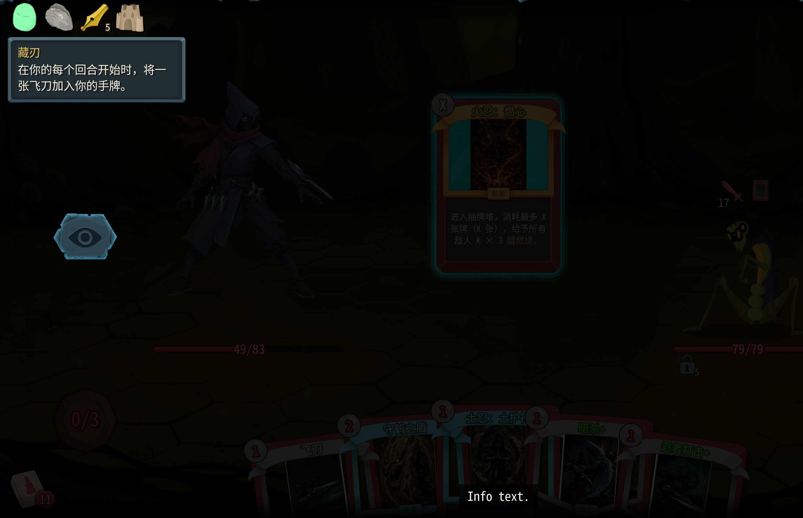

2. 圆明的效果我希望可以叠加层数。就是每次打出武藏的牌，回复当前圆明层数的血量

3. 聚石刺：1费，造成6(9)点伤害，获得3(4)层抵挡。调整改成
聚石刺：1费，造成6(9)点伤害，获得6(9)点格挡。

5. 淬火
完成我的所有修复和改动：

调整卡牌以及对应的README和数值表格：

武藏：承袭调整：改成 
3(2)⚡ 技能 · 消耗
将各一张【神速】【空明斩】【刺】加入手牌。下回合开始获得3点能量。

土忍：土护符的实际格挡值和牌面值不一样。

3. 守鹤之盾的牌面数值动态显示不对。目前固定都是显示0

4. 火忍：燃心：有bug，不是我想要的效果。比如说当前有X能量那么就画掉我的X点能量并且进入抽牌堆界面，玩家可以选择在抽牌堆中，消耗最多X张牌（也可以消耗少于X张牌），然后对所有敌人施加消耗牌数 * 3 的燃烧层数。升级后增加保留效果。目前会卡在这个界面没有办法退出，而且也无法选择消耗的牌。杀戮尖塔2其实已经有类似的接口了你需要复刻一下——

6. 追魂的实现效果有问题，打出所有消耗的飞刀的时候，应该是真的模拟把消耗牌堆中的飞刀每一张快速的重新打出。目前的效果好像是造成飞刀伤害 * 消耗牌堆中飞刀的数量。但是首先，实际上有些飞刀的攻击值是不一样有些是7有一些是5，然后飞刀还会附加流血效果，这个也没有。总之就是需要真的模拟真实飞刀重新被完全打出来一遍的效果。

8. fix:土忍：裂地的卡面实时数值显示不对，我希望是所有敌人的负面效果的层数之和。比如说有3层燃烧，2层流血，那么裂地的伤害就是5点。这个需要修复。

10. 锋刃能力调整：改成后续所有手里剑、飞刀、苦无、燃烧手里剑的能量消耗降低1点。
> 目前是牌堆里的消耗降低1点，这意味着后续每回合生成的飞刀能量仍然是1费。我需要不仅牌堆里的、手牌里的减少1，包括后续生成的飞刀、手里剑、苦无、燃烧手里剑的能量消耗都减少1点。

