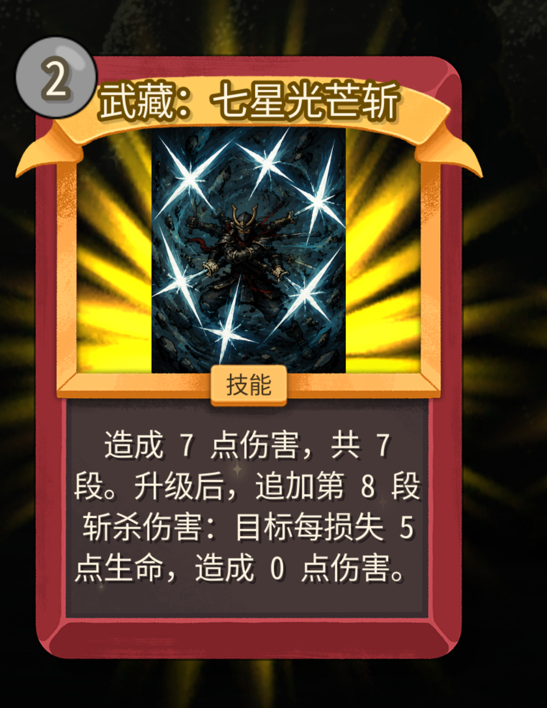

1. 残影生成的残影牌应该是复制我当时打出的攻击牌，只不过把这张临时token牌的费用改成0并且伤害减半。目前的生成残影是在弃牌堆里生成一个0 费的残影攻击牌，但是这个卡面显示看不到是什么牌啊。这是严重bug。

2. 圆明的效果我希望可以叠加层数。就是每次打出武藏的牌，回复当前圆明层数的血量

3. 聚石刺：1费，造成6(9)点伤害，获得3(4)层抵挡。调整改成
聚石刺：1费，造成6(9)点伤害，获得6(9)点格挡。

4. 这个七星光芒斩，卡面上不要说升级后的效果。
我的意思是默认原卡牌上面只有 7 *7段伤害，
如果这卡牌被升级，就是再后面再写：额外造成一段xxx(按照目前的写法）
总之就是不要再在卡牌上直接写升级后的效果。只有真的升级了才写出来

完成我的所有修复和改动：

2. 目前隐身状态的结束做的不太好，我是希望改动：
> 增加一种卡牌的机制，叫“静默”，这个机制和杀戮已经有的消耗、奇巧、虚无什么的都一样是用黄色字体显示的。一张卡牌如果有静默，他打出后就不会破除隐身。
> 你需要实现静默的机制，并且给目前的暗杀和影心刺的卡牌加上“静默”的机制。然后暗杀的卡牌牌面需要修改一下。删除“打出这卡牌不会破隐身”的描述，只需要加上“静默”。
> 你还需要给静默实现悬浮卡牌侧边提示，类似杀戮2的其他效果，悬浮在上面看的到提示；
> 另外静默机制需要能够做好接口保留，我有一些卡牌后续我会改成：升级后增加静默机制。这个需要保留好接口。

3. 守鹤之盾的牌面数值动态显示不对。目前固定都是显示0

4. 火忍：燃心：有bug，不是我想要的效果。比如说当前有X能量那么就画掉我的X点能量并且进入抽牌堆界面，玩家可以选择消耗最多X张牌（也可以消耗少于X张牌），然后对所有敌人施加消耗牌数 * 3 的燃烧层数。升级后增加保留效果。目前根本没有进入抽牌堆选择消耗的步骤

5. 多重罗生门需要调整，我是设计是抽到的3(4)张牌中，每有一张攻击牌获得9点。而不是根据手牌中的攻击牌来的！这个需要修复

6. 追魂的实现效果有问题，打出所有消耗的飞刀的时候，应该是真的模拟把消耗牌堆中的飞刀每一张快速的重新打出。目前的效果好像是造成飞刀伤害 * 消耗牌堆中飞刀的数量。但是首先，实际上有些飞刀的攻击值是不一样有些是7有一些是5，然后飞刀还会附加流血效果，这个也没有。总之就是需要真的模拟真实飞刀重新被完全打出来一遍的效果。

8. fix:土忍：裂地的卡面实时数值显示不对，我希望是所有敌人的负面效果的层数之和。比如说有3层燃烧，2层流血，那么裂地的伤害就是5点。这个需要修复。

10. 锋刃能力调整：改成后续所有手里剑、飞刀、苦无、燃烧手里剑的能量消耗降低1点。
> 目前是牌堆里的消耗降低1点，这意味着后续每回合生成的飞刀能量仍然是1费。我需要不仅牌堆里的、手牌里的减少1，包括后续生成的飞刀、手里剑、苦无、燃烧手里剑的能量消耗都减少1点。

9. 七星光芒斩也搞错了：改成：
    默认2费，技能，造成7 x 7点伤害。
    （升级后：2费，技能，造成7 x 7点伤害。第八段造成一段斩杀伤害：造成敌人的伤害是敌人每损失5点生命，额外造成1点伤害，例如已经损失50点，额外造成10点伤害）

10. 残影的效果你也搞错了：每打出一张攻击牌，在弃牌堆中额外生成【残影层数】张0费的【残影攻击牌】，残影复制造成的伤害减半。消耗。比如说，当前残影是2层，那么打出一张攻击牌，就会在弃牌堆中生成2张0费的残影攻击牌。这个攻击牌只造成原本牌的伤害的一半，并且不会再生成残影。然后呢，残影术这张牌是可以获得1层残影的能力牌。

11.  燃烧附加的手里剑目前的贴图特效不应该是整个游戏都出现这样的！！！这个贴图应该出现在卡牌上啊，实在做不到就删掉。

