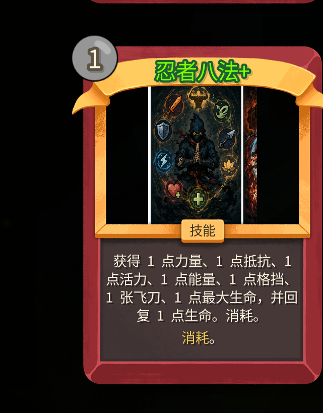
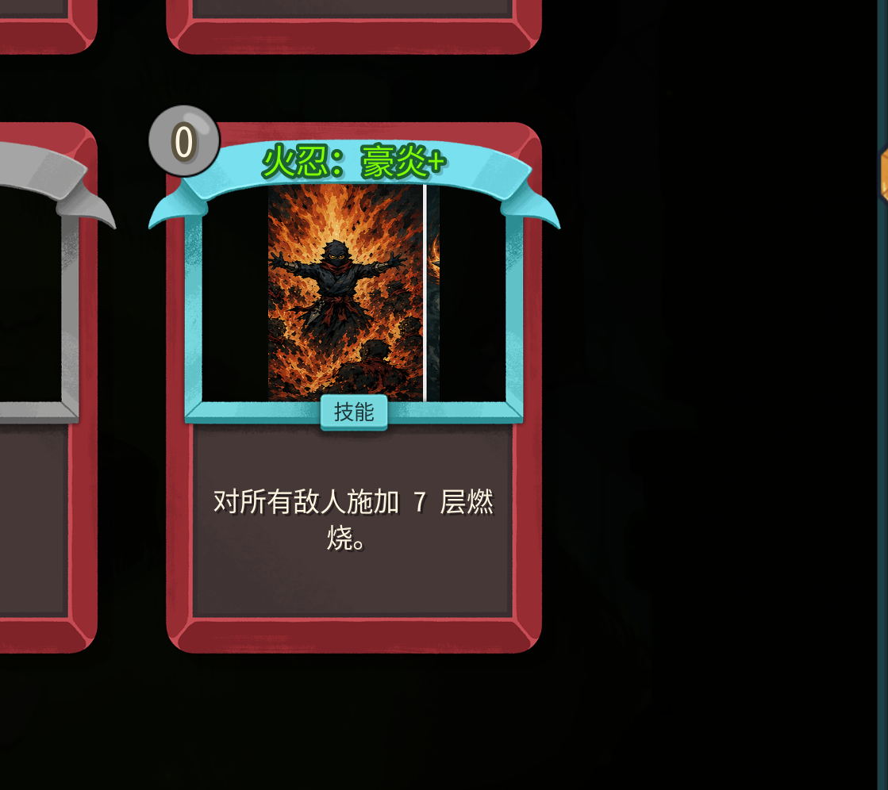
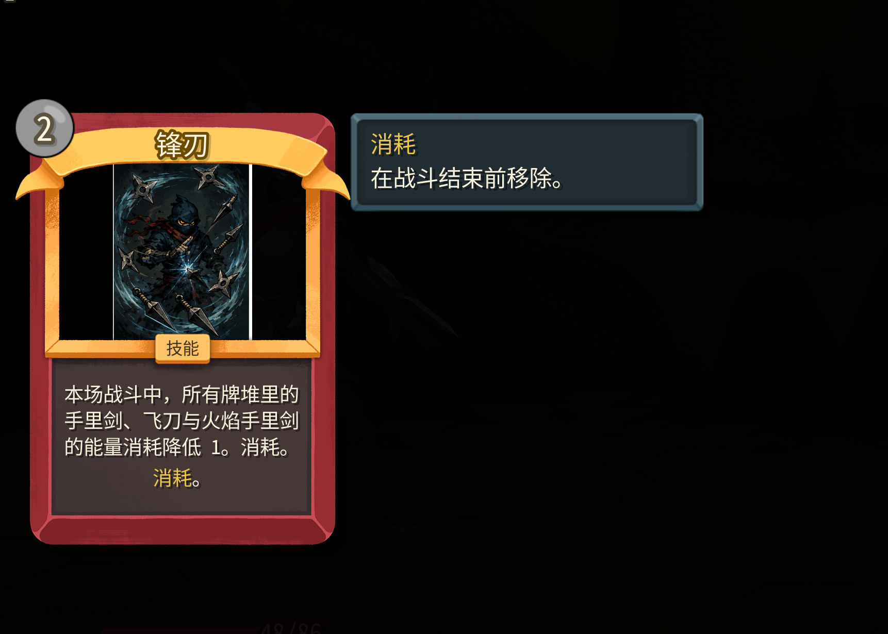

upd: 

给我所有设计的效果增加悬浮提示，比如说流血在卡牌的右侧应该和其他什么消耗的一样有提示。

升级效果问题：fix

忍者八法升级后移除消耗的效果并没有在卡面显示做出来，而且我也不确定是否真的移除了。

豪炎的升级效果也没有做出来，在锻造这里看不到升级效果。

upd: 
锋刃我觉得需要改成能力牌。其他不变

fix: burning_infusion_frame这个是需要给有燃烧追加的卡牌加上的特效贴图，是给卡牌的周围边框包裹一圈的特性。比如说，我有淬火能力的时候、或者我得到了有燃烧附加的手里剑，应该给能够打出淬火特性的攻击牌实时动态包裹上这个燃烧边框。

fix: 
火盾这里左下角人物的buff层数和提示说明不一致。而且护盾

4. 土忍：裂地：1费，技能，对所有目标造成当前负面效果层数的伤害。消耗。
这个牌需要调整：
改成土忍：裂地：1费，技能，获得所有敌人的、负面效果层数之和、的格挡。消耗（升级后失去消耗）

fix:火忍灰烬：在点燃成功后没有抽牌。

upd: 
：[burning_infusion_frame.png](D:/--UnityProject/RunminG-Lab/SlaytheSpire2_mod/NinjaMod/images/card_effects/burning_infusion_frame.png)这个贴图已经做好了加给燃烧附加的特效
